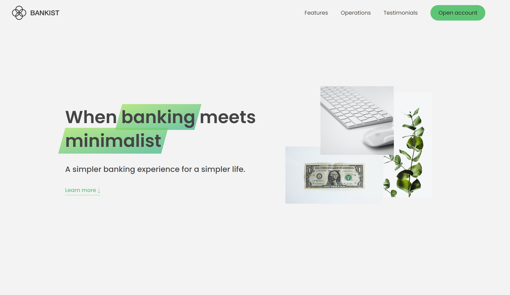
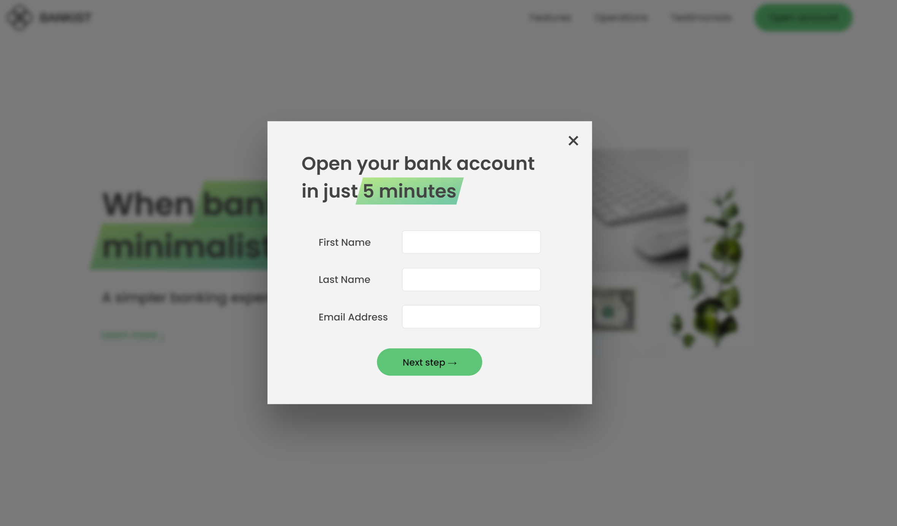
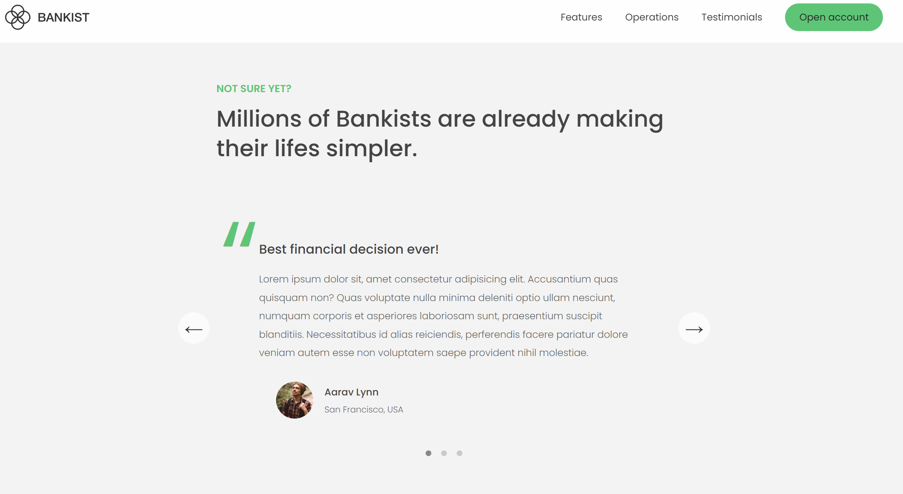

# Bankist — Веб-сайт Банковских Услуг

## Описание
Bankist — это минималистичный веб-сайт, который предлагает быстрый и удобный доступ к банковским услугам. Этот проект выполнен с использованием современных веб-стандартов и технологий, таких как HTML, CSS и JavaScript.

## Особенности
- **Навигационное меню:** Плавная прокрутка до различных разделов веб-сайта через верхнее меню.
- **Слайдер отзывов:** Интерактивный слайдер для просмотра отзывов клиентов.
- **Модальные окна:** Всплывающие окна для быстрой регистрации новых пользователей.
- **Ленивая загрузка изображений (Lazy Loading):** Загрузка изображений по мере прокрутки для улучшения производительности.

## Технологии
- **HTML5** для структуры веб-сайта.
- **CSS3** для стилизации и анимаций.
- **JavaScript ES6+** для интерактивных элементов и динамического контента.

## Запуск
Чтобы запустить это приложение локально с помощью Live Server:

1. Установите [Visual Studio Code](https://code.visualstudio.com/), если вы этого ещё не сделали.
2. Установите расширение [Live Server](https://marketplace.visualstudio.com/items?itemName=ritwickdey.LiveServer).
3. Клонируйте репозиторий приложения на свой локальный компьютер.
4. Откройте папку проекта в Visual Studio Code.
5. Перейдите в файл `index.html`.
6. Нажмите правой кнопкой мыши на файл и выберите `Open with Live Server`, или воспользуйтесь комбинацией клавиш `Alt+L Alt+O`.
7. Ваш браузер автоматически откроет приложение по адресу `http://127.0.0.1:5500/` или другому порту, если 5500 уже используется.

## Интерфейс

